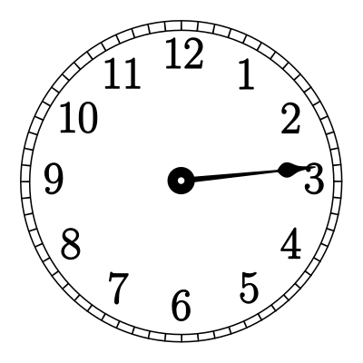
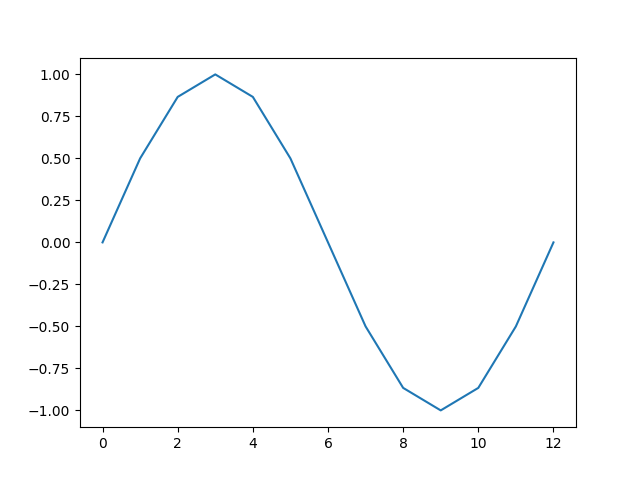
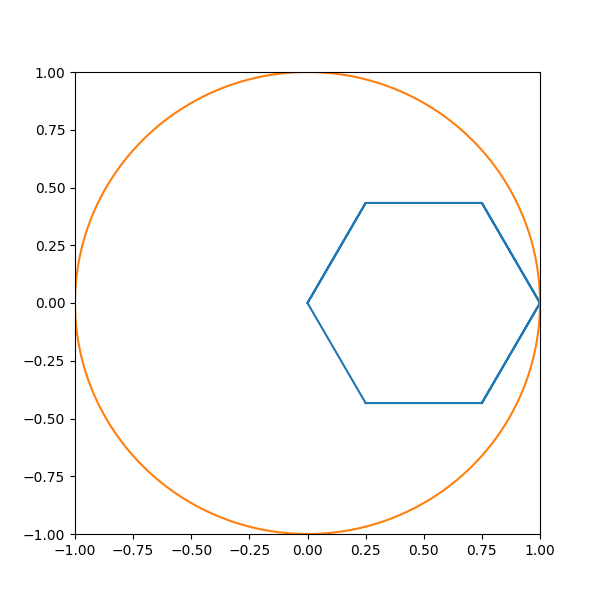
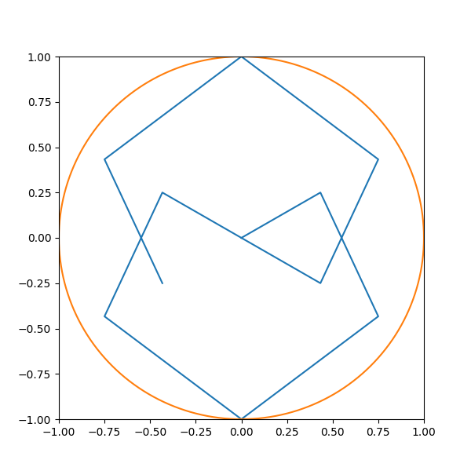

# The Beautifully Simple Complex Maths of Digital Filters

_intro_

<!-- ## The Discrete-Time Signal

Audio signals are typically represented on a graph of amplitude against time. At different points in time the signal is at a particular amplitude, and it is this changing of amplitude that our ears interpret as sound.

In the digital world, we still represent audio signals in this way except we sample the signal at regular time intervals since computers aren't very good at representing continuous signals. We call this a _discrete-time_ signal. -->

## The Impulse Response

In a system that has a discrete-time input, $x(n)$ and a discrete-time output, $y(n)$, the system's _impulse response_, $h(n)$ can be calculated by taking the difference between the system's output and its input.

$$ h(n) = {y(n) \over x(n)} $$

Analysing a system's impulse response can reveal much about its time-domain characteristics such as whether the system introduces latency, has a potential feed-back loop, and so on.

### Example 1 - Constant Impulse Response

For a system with an input signal $x(n)=sin(n)$ and an output signal $y(n)=3 \cdot sin(n)$, its impulse response, $h(n)$ can be calculated by taking the difference between $y(n)$ and $x(n)$.

$$ h(n) = {3 \cdot sin(n) \over sin(n)} $$
$$ h(n) = 3 $$

The system's impulse response is a constant meaning that the input signal is straightforwardly amplified by the constant to produce the output signal. In the context of audio, this system would be a gain effect.

### The Difference Equation

Digital signals are often too complex to express in a straightforward equation such as $sin(n)$. For this reason, it is common to describe a system by its _difference equation_ where the system's input signal is represented straightforwardly as $x(n)$, and its output signal, $y(n)$ is represented as some function of $x(n)$.

For example, the system in Example 1 would have a difference equation as follows.

$$ y(n)=3 \cdot x(n) $$

Representing a system by its difference equation is often a more intuitive way to understand the system than looking at its impulse response alone. Saying that a system's output is three-times its input is easier to grasp than to say a system has an impulse response of $3$.

### Example 2 - Time

$$ y(n)=b_0 \cdot x(n) + b_1 \cdot x(n-1) $$

In this system, the output signal is composed of some amount of the current input sample, $x(n)$ as well as some amount of the _previous_ input sample, $x(n-1)$. Therefore, this system introduces an element of time.

$$ h(n) = {b_0 \cdot x(n) + b_1 \cdot x(n-1) \over x(n)} $$
$$ h(n) = b_0 + {b_1 \cdot x(n-1) \over x(n)} $$

Analysing the impulse response of this system doesn't reveal much about how it might sound in the context of an audio effect. To reveal more, the _frequency_ domain should be analysed using the _Z-Transform_.

## The Z-Transform

A typical digital signal is represented in the time domain on a graph of amplitude against time - this shows the magnitude of the waveform at any given point in time. Contained within this is some frequency information - the more the signal changes in a shorter period of time, the higher the frequency. Measuring this frequency content however is not trivial as it requires some _complex_ maths.

The Z-Transform is used to convert a signal in the time domain into a _complex_ frequency-domain signal. To say the frequency-domain signal is complex does not mean that it is difficult to understand, but that it is composed of [complex numbers](https://www.mathsisfun.com/numbers/complex-numbers.html).

The fundamental concept of the Z-Transform is to take the time-domain signal and "wrap" it around a circle at varying frequencies and for each frequency measure the average position of each sample to find the relative magnitude of that frequency in the signal.

### The Clock Face

Consider an audio signal of 60 samples. Every second, the left-most sample is removed from the signal and placed somewhere along the second hand of a clock, relative to the amplitude of the sample. A sample with an amplitude of $+1.0$ will be placed at the very tip of the second hand, a sample with an amplitude of $+0.5$ will be placed midway along the hand, closer to the centre of the clock, and a sample with an amplitude of $0.0$ is placed at the very centre. For samples with a _negative_ amplitude, the hand is extended backwards to also point $180°$ from the main part of the hand - negative numbers are placed along this backwards-extension of the hand. For example, while the hand is pointing at the number $2$ on the clock, a sample with an amplitude of $-1.0$ would be placed at the number $8$ on the clock.

After a minute has passed, the whole signal has been placed around the clock face. By finding the mean position of all the points the _magnitude_ of the signal at $1Hz$ can be calculated by finding the distance from the centre of the clock to the mean position. To find the magnitude at different frequencies, samples must be placed more or less often around the clock face. For example, to find the magnitude of the frequency at $2Hz$, the samples must be removed from the discrete-time signal and placed on the clock face every $2$ seconds.

The _phase_ of a particular frequency can also be found by taking the angle around the clock face at which the mean of all the points lies. Two signals could contain the same frequency at the same amplitude but different phases and thus sound quite different.

#### Example - 12 Sample Sine

Given a full cycle of a $1Hz$ sine wave composed of just 12 samples, we can calculate the magnitude of the signal's frequency response at $1Hz$ by plotting the sine wave around the clock face, placing one sample every 5 seconds, so the full cycle is placed around one rotation of the second hand.

At $0s$, the first sample is placed at the centre of the clock since it has a magnitude of $0.0$. At $5s$ the second sample is placed midway along the hand, towards the 1 on the clock. At $10s$ the third sample is placed ~85% of the way along the hand, towards the 2 on the clock, at $15s$ the third sample is placed at the 3 on the clock. The shape is then mirrored for the next 3 samples as the hand moves round to the 6. From here, since the second half of samples are all negative, they're all placed on the backwards-extension of the second hand, and since the shape of the second half of the wave is identical to the first half, the second half of the wave is plotted exactly as the first half was.

After a full minute, the clock face looks something like this:

The mean of all of these points is $(0.5, 0.0)$ and therefore the relative magnitude of the signal at $1Hz$ is $0.5$. Since this is a _relative_ magnitude, it's not much use on its own, so it should be compared against the magnitude at other frequencies.

Doing the exact same process again, but this time plotting a sample every _10_ seconds instead of 5, the magnitude response of the signal at $2Hz$ can be calculated.

This time, the mean of all the points is $(0.0, 0.0)$ and so the relative magnitude of the signal at $2Hz$ is $0.0$.

Since we know the signal was a $1Hz$ sine wave, it's only logical that the signal would have no magnitude at $2Hz$, but some magnitude at $1Hz$.

## Euler's Formula and $z$

Rather than manually plotting the samples on a clock face, a more mathematical approach can be taken to make the process far more efficient.

### The Step Size

In the examples above, samples were placed around the clock face at varying time intervals according to the frequency at which the magnitude of the signal was to be calculated. The more mathematical way to approach this would be to calculate the step size in [radians](https://mathworld.wolfram.com/Radian.html#:~:text=The%20radian%20is%20a%20unit,or%2057.) at which to plot the points for a given frequency. To do this, the desired frequency, $f$ is divided by the sampling rate, $f_s$. This normalised frequency value is then multiplied by $2 \pi$ to get the required step size, $\theta$:

$$ \theta = 2 \pi \cdot {f \over f_s}$$

For each sample, the step size is simply multiplied by the index, $n$ of the given sample to find the angle about the centre of the clock face at which that sample should be plotted.

### Efficient Plotting

A given point, $(X, Y)$ has an angle about the origin of $\theta$, and a distance from the origin of $M$. Such a point can be represented as $(M \cdot cos(\theta), M \cdot sin(\theta))$. This is a useful and straightforward way to represent a point, but not particularly efficient to calculate since computationally, trigonometric functions are fairly expensive. Instead, [Euler's Formula](https://en.wikipedia.org/wiki/Euler%27s_formula) can be used to simplify the calculation:

$$ e^{j \theta} = cos(\theta) + j \cdot sin(\theta) $$

Now, instead of two real numbers to represent the $X$ and $Y$ coordinates, a single complex number is used to represent the point. The real part of the complex number represents the $X$ coordinate, and the imaginary part represents the $Y$ coordinate. This also means that instead of a clock face with $X$ and $Y$ axes, the $z$-plane is used with real numbers running horizontally and imaginary numbers running vertically.

By combining Euler's Formula with the calculation for the step size at a given frequency, the position of each sample on the $z$-plane, $p(x(n))$ can be calculated as follows:

$$ p(x(n)) = x(n) \cdot e^{-n \cdot j \cdot 2 \pi \cdot {f \over f_s}} $$

This calculation is much simpler to calculate than the individual coordinates, but is still not the most efficient way to calculate $p(x(n))$. By making use of the fact that $(a^b)^c = a^{b \cdot c}$, and that the only thing in the calculation for the angle in the previous equation that needs to change for each sample is $n$, the equation can be rewritten as follows

$$ z = e^{j \cdot 2 \pi \cdot {f \over f_s}} $$
$$ p(x(n)) = x(n) \cdot z^{-n} $$

### The Z-Transform

Finally, the mean of each of the points on the $z$-plane can be calculated by simply summing each of the points together. This can be expressed mathematically as:

$$ X(z) = \sum_{n=0}^{N} x(n) \cdot z^{-n} $$

This equation is the Z-Transform, where $X(z)$ is the complex frequency-domain representation of the signal, $x(n)$ for the given frequency, $f$ (in turn used to calculate the constant, $z$).

The _frequency_ response of the signal can then be calculated by taking the _magnitude_ of $X(z)$, and the _phase_ response of the signal can be calculated by taking the _angle_ of $X(z)$.

## The Transfer Function

A system's transfer function, $H(z)$ is the complex frequency-domain representation of the system's impulse response, $h(n)$. A system's transfer function can be calculated by taking the Z-Transform of the system's impulse response:

$$ H(z) = \sum_{n=0}^{N} h(n) \cdot z^{-n} $$

Alternatively, a system's transfer function can be calculated by taking the difference between the complex frequency-domain representation of the system's output, $Y(z)$, and that of its input, $X(z)$:

$$ H(z) = {Y(z) \over X(z)} $$

### Example 1 - Delayed Input

$$ y(n) = b_0 \cdot x(n) + b_1 \cdot x(n-1) $$

The complex frequency-domain representation of the system's output $Y(z)$ can be calculated as:

$$ Y(z) = \sum_{n=0}^{N} (b_0 \cdot x(n) + b_1 \cdot x(n-1)) \cdot z^{-n} $$
$$ Y(z) = b_0 \cdot X(z) \cdot z^0 + b_1 \cdot X(z) \cdot z^{-1} $$
$$ Y(z) = X(z) \cdot (b_0 + b_1 \cdot z^{-1}) $$

The system's transfer function, $H(z)$ can be calculated as:

$$ H(z) = {{ X(z) \cdot (b_0 + b_1 \cdot z^{-1})} \over X(z)} $$
$$ H(z) = b_0 + b_1 \cdot z^{-1} $$

Without even using any values for $b_0$, $b_1$, or $z$, this transfer function alone shows how the frequency and phase response of the system is independent of that of its input signal or output signal (i.e. neither the terms $X(z)$ nor $Y(z)$ appear in the transfer function).

Using this transfer function and choosing some values for $b_0$ and $b_1$, the frequency and phase response of the system can be calculated for varying frequencies:

$$ b_0 = 0.4, b_1 = 0.6, f_s = 100Hz $$

| $f$    | $z$             | $H(z)$          | Frequency Response | Phase Response |
| ------ | --------------- | --------------- | ------------------ | -------------- |
| $0Hz$  | $1.00 + 0.00j$  | $1.00 + 0.00j$  | $1.00$             | $-0.00°$       |
| $10Hz$ | $0.81 + 0.59j$  | $0.89 - 0.35j$  | $0.95$             | $-21.72°$      |
| $20Hz$ | $0.31 + 0.95j$  | $0.59 - 0.57j$  | $0.82$             | $-44.27°$      |
| $30Hz$ | $-0.31 + 0.95j$ | $0.21 - 0.57j$  | $0.61$             | $-69.39°$      |
| $40Hz$ | $-0.81 + 0.59j$ | $-0.09 - 0.35j$ | $0.36$             | $-103.61°$     |
| $50Hz$ | $-1.00 + 0.00j$ | $-0.20 + 0.00j$ | $0.20$             | $-180.00°$     |

Since the frequency response at $0Hz$ has the largest magnitude, and the magnitude of the responses gets less as the frequency increases, in the context of an audio effect this system using the given $b_0$ and $b_1$ coefficients must be a low-pass filter.

Different types of filter can be achieved with different coefficients - for example negative values of $b_0$ can be used for a high-pass filter.

### Example 2 - Delayed Output

For a system with a difference equation,

$$ y(n) = b_0 \cdot x(n) + a_1 \cdot y(n-1) $$

The complex frequency-domain representation of the system's output can be calculated as follows.

$$ Y(z) = \sum_{n=0}^{N} (b_0 \cdot x(n) + a_1 \cdot y(n-1)) \cdot z^{-n} $$
$$ Y(z) = b_0 \cdot X(z) \cdot z^0 + a_1 \cdot Y(z) \cdot z^{-1} $$
$$ Y(z) - a_1 \cdot Y(z) \cdot z^{-1} = b_0 \cdot X(z) \cdot z^0 $$
$$ Y(z) \cdot (1 - a_1 \cdot z^{-1}) = X(z) \cdot b_0 $$
$$ Y(z) = X(z) \cdot {b_0 \over {1 - a_1 \cdot z^{-1}}} $$

Which can be used to calculate the system's transfer function.

$$ H(z) = {{X(z) \cdot {b_0 \over {1 - a_1 \cdot z^{-1}}}} \over X(z)} $$
$$ H(z) = {b_0 \over {1 - a_1 \cdot z^{-1}}} $$

<!-- ---

$$ H(z) = {{a_0 + 0 \cdot z^{-1} + 0 \cdot z^{-2}} \over {1 - b_1 \cdot z^{-1} + 0 \cdot z^{-2}}} $$

---

$$ z = {-b \pm \sqrt {b^2 - 4ac} \over 2a} $$
$$ z = {0 \pm \sqrt {0^2 - 4 \cdot -a_0 \cdot 0} \over {2 \cdot -a_0}} $$
$$ z = 0 $$

--- -->

<!-- ---

$$ f(x) = [x \cdot 2^Q] $$

--- -->

Similarly to the previous example, different values of $b_0$ and $a_1$ can be used to control the characteristics of the filter.

One of the dangers of blindly choosing filter coefficients however is that when combined in the wrong way, coefficients can make a filter _unstable_, meaning that its response could result in a signal that's amplitude increases over time, quickly becoming very loud. In this last example, if the $a_1$ coefficient were $>1$, each output sample would then be amplified in the next output's calculation and so the signal's amplitude could increase exponentially.

## Stable Filters

A filter is considered stable if it produces a _limited_ output signal for any given _limited_ input signal. A limited signal is a signal with amplitude values within a given range. Different systems may have different limits on their input and output signals, but in the context of audio, signals are typically limited to a range of $0 - 1$. Therefore, an audio filter is considered stable if, for any given input signal, $x(n)$ in the range $0 - 1$, it produces an output signal, $y(n)$ in the range $0 - 1$.

A filter's stability will sometimes be apparent from its difference equation.

$$ y(n) = {x(n) + y(n-1) \over a_1} $$

_This filter will be stable when $a_1 \geq 2$._

However, when looking at transfer functions it is often much trickier to determine whether the filter will be stable or not.

$$ H(z) = {b_0 \over {1 - a_1 \cdot z^{-1}}} $$

Even after substituting values for the $b_0$ and $a_1$, it's not apparent whether this filter will always produce an output from $0-1$ for input values from $0-1$. In order to determine a filter's stability from its transfer function, the _zeros and poles_ of the transfer function must be analysed.

### Zeros and Poles

The zeros and poles of a transfer function, $H(z)$ are the values of $z$ for which $H(z)=0$ and $H(z)=∞$ respectively. Since $H(z) = {Y(z) \over X(z)}$, the zeros of the transfer function are found at $Y(z)=0$ and the poles at $X(z)=0$. Therefore, to calculate the position of a transfer function's zeros and poles, the roots of $Y(z)$ and $X(z)$ must be calculated.

The roots of an equation, $y=x$ are the values of $x$ for which $y=0$. Calculating these roots can be extremely tricky for some equations, and so transfer functions are typically expressed in terms of polynomials. Such a transfer function can be expressed as:

$$ H(z) = {{b_0 + b_1 \cdot z^{-1} + b_2 \cdot z^{-2} + ... + b_N \cdot z^{-N}} \over {a_0 + a_1 \cdot z^{-1} + a_2 \cdot z^{-2} + ... + a_M \cdot z^{-M}}} $$

Therefor,

$$ Y(z) = b_0 + b_1 \cdot z^{-1} + b_2 \cdot z^{-2} + ... + b_N \cdot z^{-N} $$
$$ X(z) = a_0 + a_1 \cdot z^{-1} + a_2 \cdot z^{-2} + ... + a_M \cdot z^{-M} $$

The useful thing about polynomials is that the number of roots is determined by the number of coefficients. I.e. $Y(z)$ has $N+1$ roots, and $X(z)$ has $M+1$ roots.

For example, a _linear_ polynomial has the form $y=ax + b$ and so has 1 root at $x={-b \over a}$.

A _quadratic_ polynomial has the form $y=ax^2 + bx + c$ and so has 2 roots at

$$ x = {{-b \pm \sqrt {b^2 - 4ac}} \over 2a} $$

Calculating the roots for higher-order polynomials involves some very convoluted equations, and so it's usually more convenient to rewrite them in their _factored_ forms. For example:

$$ ax^2 + bx + c = (x-r_1)(x-r_2) $$

Where $r_1$ and $r_2$ are the roots of the polynomial.

Therefore, we could rewrite the equation for our generic transfer function as:

$$ H(z) = G \cdot \frac{(z-B_1)(z-B_2)...(z-B_N)}{(z-A_1)(z-A_2)...(z-A_M)} $$

Where $G$ is the overall gain of the system, calculated as $G=\frac{b_0}{a_0}$, and the $B$ and $A$ values represent the zeros and poles of the system. Note that it's common to _normalise_ a system such that $G=1$ and so it can often be omitted, leaving us with just a ratio of the two factorisations.

So for our previous transfer function, we can now rewrite it as follows:

$$ H(z) = \frac{b_0}{1 - a_1 \cdot z^{-1}} $$
$$ H(z) = \frac{1}{(z-A_1)} $$
$$ \therefore $$
$$ Y(z) = 1 $$
$$ X(z) = z-A_1 $$

Therefore the system has no zeros, since $Y(z)$ is never $0$. However we can see 

Since the zeros are found where $Y(z) = 0$, we can see how the system has no zeros. The system's poles can be found where $X(z) = 0$ and therefore at $\frac{a_1}{z} = 1$ and thus the system has a single pole at $a_1=z$.

---

<!-- A stable filter is one in which the output signal will not increase over time without influence from the input signal. I.e. if a system's input signal were suddenly cut and the system's output started getting louder and louder, that system would be unstable. If the output signal also dropped to $0$, the system would be stable.

To design such filters, one must consider the filter's Zeros and Poles

### Zeros and Poles

The zeros and poles of a transfer function, $H(z)$ are the values of $z$ for which $H(z)=0$ and $H(z)=∞$ respectively.

For a transfer function in the form $H(z)={Y(z) \over X(z)}$, the _zeros_ of the transfer function can be found where $Y(z)=0$ since ${0 \over X(z)}=0$, and the _poles_ of the transfer function can be found where $X(z)=0$ since ${Y(z) \over 0}=∞$.

Therefore, to find the zeros and poles of a transfer function, the roots of $Y(z)$ and the roots of $X(z)$ must be calculated by solving $Y(z)=0$ and $X(z)=0$ for $z$. Some equations for $Y(z)$ and $X(z)$ may have multiple roots, or none at all. -->

<!-- #### Single Roots:

- $ax + b = 0$ (straight line/linear polynomial - single root which will be at $x=∞$ if $a=0$ and $b \neq 0$)
- $e^{-x} = 0$ (exponential decay - single root at $x=∞$)
- $a_0 = 0$ (constant - single root at $x = 0$ if $a_0 = 0$, otherwise single root at $x = ∞$ (or two roots at $\pm ∞$ depending on your philosophical viewpoint and level of pedantry))

_Note that equations with roots at $x=∞$ can be considered to have no roots since having a root at $∞$ is somewhat meaningless._

#### Two Roots:

- $ax^2 + bx + c = 0$ (quadratic polynomial - roots may be _complex_ if $b^2 - 4ac < 0$, but will always have two)
- $r^2 = y^2 + x^2$ (circle - roots at $x=\pm r$)

#### Three Roots:

- $ax^3 + bx^2 + cx + d = 0$ (cubic polynomial - three roots, some may be complex)

#### Uncountable Roots:

- $sin(x) = 0$ (sine curve - infinite roots since the equation equates to $0$ when $x$ equals any integer multiple of $\pi$) -->

Since polynomials can have any number of roots depending on the number of $x^n$ terms, they are often chosen to represent a system's transfer function over any other formulae.

For example the transfer function

$$ H(z) = \sqrt {r^2 - z^2} $$

which has roots at $\pm r$, could be expressed as a polynomial in the form $ax^2 + bx + c$

$$ H(z) = {z^2 \over r} - r $$

(where $a={1 \over r}$, $b=0$, and $c=-r$) since both formulae have the same roots, and therefore both transfer functions would have the same zeros (and the same single pole at $z=∞$).

Since the frequency response of a system is determined purely by the position of the zeros and poles of the system's transfer function, the characteristics of the transfer function at any other value of $z$ other than $0$ and $∞$ make no difference to the system's frequency response.

A transfer function with $N$ zeros and $M$ poles can therefore be expressed as

$$ H(z) = {Y(z) \over X(z)} = {{b_0 + b_1 \cdot z^{-1} + b_2 \cdot z^{-2} + ... + b_N \cdot z^{-N}} \over {a_0 + a_1 \cdot z^{-1} + a_2 \cdot z^{-2} + ... + a_M \cdot z^{-M}}} $$

_Note how the powers of the $z$ terms here are negative. By rearranging the $Y(z)$ and $X(z)$ polynomials to use only positive powers the transfer function can be expressed as_

$$ H(z) = {Y(z) \over X(z)} = {{b_0 \cdot z^{N} + b_1 \cdot z^{N-1} + ... + b_{N-1} \cdot z + b_N} \over {a_0 \cdot z^{M} + a_1 \cdot z^{M-1} + ... + a_{M-1} \cdot z + a_M}} $$

It is often convenient to express the $Y(z)$ and $X(z)$ polynomials in their factored forms, in which case the transfer function becomes

$$ H(z) = G \cdot {{(z - B_1) \cdot (z - B_2) \cdot ... \cdot (z - B_N)} \over {(z - A_1) \cdot (z - A_2) \cdot ... \cdot (z - A_M)}} $$

Where $G$ is the overall magnitude (or gain, in the context of audio filters) of the transfer function, and $G = {b_0 \over a_0}$. The $B$ terms are the _complex_ zeros of the transfer function, and the $A$ terms are the complex poles. To ensure each of the $a$ and $b$ coefficients are real numbers - which is required for them to be applicable in the system's difference equation - the zeros and poles of the transfer function (the $A$ and $B$ terms) must either be purely _real_, or appear in _complex conjugate pairs_, meaning $A_{n.real} = B_{n.real}$ and $A_{n.imag} = -B_{n.imag}$.

<!-- The zeros and poles of a transfer function, $H(z)$ are the values of $z$ for which $H(z)=0$, and $H(z)=∞$ respectively. In the context of audio, the position of a filter's zeros and poles determine its frequency response. The exact correlation between the position of the zeros and poles and the filter's output is not at all intuitive, however _in general_ the zeros of the transfer function correlate to troughs in the frequency response, and the poles correlate to peaks in the frequency response.

Given the general formula for a transfer function $H(z)={Y(z) \over X(z)}$, the zeros can be found when $Y(z)=0$ since ${0 \over X(z)}=0$, and the poles can be found when $X(z)=0$ since ${Y(z) \over 0}=∞$. Therefore, in order to calculate the position of a transfer function's zeros and poles, $Y(z)$ and $X(z)$ must be solved.

#### Example 1 - Constants

Consider a system with a very straightforward transfer function:

$$ H(z) = {Y(z) \over X(z)} = {b_0 \over a_0} $$

Since $Y(z)$ and $X(z)$ are both constants, neither have any solutions for $z$ and therefore the transfer function has no zeros or poles.

#### Example 2 - Single Zero

Now, by adding a $z^{-1}$ term to $Y(z)$ of the previous example:

$$ H(z) = {Y(z) \over X(z)} = {{b_0 + b_1 \cdot z^{-1}} \over a_0} $$

Again, the transfer function has no poles since $X(z)$ is a constant, but this time the position of the zeros can be calculated by solving $Y(z)=0$ for $z$:

$$ b_0 + b_1 \cdot z^{-1} = 0 $$
$$ b_0 + {b_1 \over z} = 0 $$
$$ b_0 \cdot z + b_1 = 0 $$
$$ b_0 \cdot z = -b_1 $$
$$ z = -{b_1 \over b_0} $$

Therefore, this system has a single zero at $-{b_1 \over b_0}$.

#### Example 3 - Quadratic Polynomials

In the previous example, $Y(z)$ was a linear polynomial in the form $bx+c$ and being a linear polynomial therefore had just one solution of $-{c \over b}$.

Consider now a transfer function composed of a pair of _quadratic_ polynomials:

$$ H(z) = {{b_0 + b_1 \cdot z^{-1} + b_2 \cdot z^{-2}} \over {a_0 + a_1 \cdot z^{-1} + a_2 \cdot z^{-2}}} $$

Since $Y(z)$ and $X(z)$ are each a quadratic polynomial, each will have two solutions for $z$ which can be found using the quadratic formula. Therefore, this transfer function has two zeros and two poles. Note that since the quadratic formula features the expression $\sqrt {b^2 - 4ac}$, if $b^2-4ac<0$ then the resultant roots of the quadratic will be _complex_. This is why zeros and poles are typically depicted on a $z$-plane.

This form of transfer function is typically called a BiQuad, as it's composed of two quadratic equations. -->

## References

- https://web.mit.edu/2.14/www/Handouts/PoleZero.pdf
