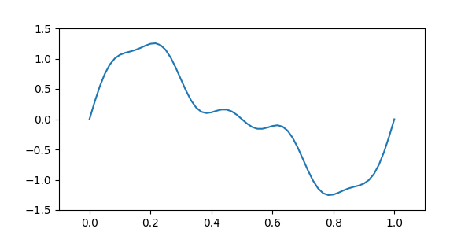

# The Beautifully Simple Complex Maths of Digital Audio Filters

## Part 1 - Introduction

**_TODO: Write intro_**

### The Impulse Response

If you've done any sort of signal processing before, you should be familiar with the _difference equation_. These equations show us what the output of some process will be for a given input.

$$ y(n) = 3 \cdot x(n) $$

These equations are useful for seeing the relationship between input and output, but they don't always reveal much about the characteristics of the resultant sound. Instead, we can rearrange the equation to find the _impulse response_, typically depicted as $h(n)$.

$$ h(n) = \frac{y(n)}{x(n)} $$
$$ h(n) = \frac {3 \cdot x(n)}{x(n)} $$
$$ h(n) = 3 $$

As the name suggests, the impulse response tells us how a system will respond to an impulse (e.g. a single sample of $1.0$). Since our impulse response in this case is a constant, we can deduce that this is a gain effect. This was probably apparent from the difference equation alone, but now we have a fancy equation to prove it.

Let's look at a more complex difference equation:

$$ y(n) = b_0 \cdot x(n) + b_1 \cdot x(n-1) $$

Here we have two constants, $b_0$ and $b_1$, our input signal, $x(n)$, and a representation of our input signal delayed by a single sample, $x(n-1)$. Let's rearrange this to find the system's impulse response:

$$ h(n) = \frac {b_0 \cdot x(n) + b_1 \cdot x(n-1)}{x(n)} $$
$$ h(n) = b_0 + \frac{b_1 \cdot x(n-1)}{x(n)} $$

This time there's not much we can derive from this equation. To get some more information about this particular system, we'll need to use a different approach.

### The Transfer Function

An impulse response only tells us about the characteristics of the system's _amplitude_ domain. However, since this impulse response features an aspect of time (thanks to the delayed $x(n-1)$ signal), we should instead analyse the system's _frequency_ domain. This is done by transforming the system's impulse response, $h(n)$ into its _transfer function_, $H(z)$.

For this particular system, the transfer function is:

$$ y(n) = b_0 \cdot x(n) + b_1 \cdot x(n-1) $$
$$ h(n) = b_0 + \frac{b_1 \cdot x(n-1)}{x(n)} $$
$$ H(z) = b_0 + b_1 \cdot z^{-1} $$

I'll explain exactly how this is derived a little later, but for now I want to highlight the similarities between $H(z)$ and $y(n)$. Note how we've effectively replaced the $x$ terms with $z$ (the first $x(n)$ term seems to have completely disappeared, but that's because there's a hidden $z^0$ term (i.e. $1.0$) being multiplied with $b_0$).

Okay, so what's this $z$ term, and where does it come from?

## Part 2 - The $z$-domain

When we looked at the impulse response, $h(n)$, $n$ was representing _time_ since it's the index of the current sample in our discrete-time signal. $n$ is not a measurement of time itself - it cannot be converted to minutes or seconds without more information (i.e. sample rate) - but it does _represent_ the time domain. Greater values of $n$ represent samples further forward in time, and smaller values of $n$ represent samples further back in time.

In a very similar way, $z$ relates to _frequency_ but is not a _measurement_ of frequency itself, it is merely a representation of the frequency domain.

We can calculate $z$ like so:

$$ z = e^{j \cdot 2 \pi \cdot \frac{f}{f_s}} $$

Where $j$ is the imaginary unit equal to $\sqrt {-1}$, $f_s$ is the system's sampling rate, and $f$ is the frequency for which we're calculating $z$.

This equation is derived from Euler's Formula, which is a formula used to represent a point on the circumference of a circle using a complex number.

$$ e^{j \cdot \omega} = cos(\omega) + j \cdot sin(\omega) $$

So, for $z$ we can determine that:

$$ \omega = 2 \pi \cdot \frac{f}{f_s} $$

Since $\omega$ is representing an angle, and its value is determined by a scaling of $2 \pi$, we can see how increasing values of $f$ up to the sample rate will rotate the angle through a full $360^\circ$. Therefore, when dealing with the $z$-domain, it can be useful to think of $z$ as a frequency value that's been "wrapped" around a circle, rather than plotted on a horizontal axis.

**_TODO: Add some step-by-step diagrams to show frequency mapped to $z$ at different values._**

### The $z$-transform

Now that we have an understanding of $z$, we can look at how we can convert a signal in the time-domain to a signal in the $z$-domain. This conversion is called the $z$-transform.

The result of the $z$-transform tells us the relative amplitude (and phase) of the signal for a given frequency (represented by $z$). This is done by essentially "wrapping" the time-domain of our signal around a circle and taking an average position of each of the samples. The distance of this point from the origin will tell us the relative amplitude of that particular frequency, and the angle of the point will give us the phase.

For example, consider this signal:

**_TODO: Finish this example with diagrams, etc._**

We can express this process mathematically like so:

$$ X(z) = \sum_{n=0}^{N} x(n) \cdot z^{-n} $$

When $n=0$, the first sample of the input signal $x(n)$ will be placed at $0°$. As $n$ increases, further samples will be added at angles of intervals determined by $z$. If we use a greater frequency value to calculate $z$, the angle between subsequent samples will be greater.

Note that the transfer function of an impulse response can be calculated as the difference of the transfer function of the system's output and its input, i.e.:

$$ H(z) = \sum_{n=0}^{N} h(n) \cdot z^{-n} $$
$$ H(z) = \sum_{n=0}^{N} \frac{y(n)}{x(n)} \cdot z^{-n} $$
$$ H(z) = \frac{Y(z)}{X(z)} $$

Therefore, we can now use the $z$-Transform to calculate the transfer function of our impulse response. First, we'll define the transfer function of our output:

$$ y(n) = b_0 \cdot x(n) + b_1 \cdot x(n-1) $$
$$ Y(z) = \sum_{n=0}^{N} (b_0 \cdot x(n) + b_1 \cdot x(n-1)) \cdot z^{-n} $$

Next, we can expand the series and pull out common factors. In this case we can find a common factor of $b_0+b_1 \cdot z^{-1}$:

$$ Y(z) = [x(0) \cdot b_0 \cdot z^0 + x(-1) \cdot b_1 \cdot z^0] + [x(1) \cdot b_0 \cdot z^{-1} + x(0) \cdot b_1 \cdot z^{-1}] + ... $$
$$ Y(z) = x(0) \cdot (b_0 \cdot z^0 + b_1 \cdot z^{-1}) + x(1) \cdot (b_0 \cdot z^{-1} + b_1 \cdot z^{-2}) + ... $$
$$ Y(z) = x(0) \cdot z^{0} \cdot (b_0 + b_1 \cdot z^{-1}) + x(1) \cdot z^{-1} \cdot (b_0 + b_1 \cdot z^{-1}) + ... $$
$$ Y(z) = \sum_{n=0}^{N} x(n) \cdot z^{-n} \cdot (b_0 + b_1 \cdot z^{-1}) $$

And, given the transfer function of our _input_:

$$ X(z) = \sum_{n=0}^{N} x(n) \cdot z^{-n} $$

We can rewrite the transfer function of our _output_ in terms of $X(z)$:

$$ Y(z) = X(z) \cdot (b_0 + b_1 \cdot z^{-1}) $$

Which gives us a much simpler equation to use to calculate the transfer function of our impulse response:

$$ H(z) = \frac{Y(z)}{X(z)} = \frac{X(z) \cdot (b_0 + b_1 \cdot z^{-1})}{X(z)} = b_0 + b_1 \cdot z^{-1} $$

At last, we have an equation that describes the characteristics of our system in the frequency domain! We can determine from this that a given frequency, represented by $z$ will be manipulated in some way by the $b_0$ and $b_1$ coefficients.

### Spectral Analysis

Let's set $b_0=0.4$, and $b_1=0.6$, and calculate the magnitude response for different values of $z$ (with a sample rate of $100Hz$) using our transfer function:

| $f$    | $z$             | $H(z)$          | Frequency Response | Phase Response |
| ------ | --------------- | --------------- | ------------------ | -------------- |
| $0Hz$  | $1.00 + 0.00j$  | $1.00 + 0.00j$  | $1.00$             | $-0.00°$       |
| $10Hz$ | $0.81 + 0.59j$  | $0.89 - 0.35j$  | $0.95$             | $-21.72°$      |
| $20Hz$ | $0.31 + 0.95j$  | $0.59 - 0.57j$  | $0.82$             | $-44.27°$      |
| $30Hz$ | $-0.31 + 0.95j$ | $0.21 - 0.57j$  | $0.61$             | $-69.39°$      |
| $40Hz$ | $-0.81 + 0.59j$ | $-0.09 - 0.35j$ | $0.36$             | $-103.61°$     |
| $50Hz$ | $-1.00 + 0.00j$ | $-0.20 + 0.00j$ | $0.20$             | $-180.00°$     |

From this we can see that our system is in fact a low-pass filter since higher frequencies are attenuated more than lower frequencies. We could play around with other values for $b_0$ and $b_1$ to see what other sort of responses we could get out of this system, however choosing them at random like we just did won't be very efficient and could even lead to some _unstable_ filters if we're not careful. Instead, let's look a little deeper at these coefficients, and how they relate to the system's _Zeros_ and _Poles_.

## Part 3 - The Zeros and Poles

The zeros and poles of a transfer function, $H(z)$, are the specific values of $z$ for which $H(z)=0$ and $H(z)=∞$ respectively. The position of these zeros and poles on the $z$-plane will determine the shape of the system's frequency response.

For example a system with a pair of zeros at $0 \pm 0.8j$ will have a frequency response with an attenuation at $0.25 \cdot f_s$.

**_TODO: Add diagram showing the above example._**

Similarly, a system with a pair of _poles_ at $0 \pm 0.8j$ will have a frequency response with a peak at $0.25 \cdot f_s$.

**_TODO: Add diagram showing the above example._**

For our previous transfer function, $H(z)$ we can solve for $H(z)=0$ to find the position of its zeros:

$$ H(z) = b_0 + b_1 \cdot z^{-1} $$
$$ 0 = b_0 + b_1 \cdot \frac{1}{z} $$
$$ b_0 = -b_1 \cdot \frac{1}{z} $$
$$ b_0 \cdot z = -b_1 $$
$$ z = -\frac {b_1}{b_0} $$

Therefore, our system has a single zero at $-\frac{b_1}{b_0}$. If we again add in our values of $0.4$ and $0.6$, we can see that we have a zero at $-\frac{0.6}{0.4}=-1.5$:

**_TODO: Add diagram showing the above example._**

If we agree that $\frac {1}{0}=∞$, then we can also say that our system has a pole at $z=0$.

### Polynomials in Transfer Functions

If you haven't already realised, what we did there to calculate the system's zeros was to find the _roots_ of its transfer function. Therefore, calculating the zeros of a system's transfer function is as easy as finding its roots. For this reason, transfer functions are very commonly written as _polynomials_, since calculating the roots of a polynomial is quite straightforward, and we can explicitly define the number of roots by changing the number of terms in the polynomial.

The equation for our previous transfer function was a _linear_ polynomial in the form $y=mx+c$ and therefore had a single root. We could instead define a system with a _quadratic_ transfer function:

$$ H(z) = b_0 + b_1 \cdot z^{-1} + b_2 \cdot z^{-2} $$

For which we could find the roots using the quadratic formula to find the two zeros of the transfer function.

But what about poles? Well, since poles are found where $H(z)=∞$, and anything divided by $0$ is $∞$, we can simply add a denominator to the equation for our transfer function and find the roots of _that_ equation to find the poles. For example:

$$ H(z) = \frac {b_0 + b_1 \cdot z^{-1}}{a_0 + a_1 \cdot z^{-1}} $$

Calculating the roots of higher-order polynomials can be fiddly, therefore it's uncommon to see anything other than linear or quadratic polynomials in a transfer function. Possibly the most common transfer function (in the context of audio at least) is expressed as the ratio of two quadratic equations:

$$ H(z) = \frac {b_0 + b_1 \cdot z^{-1} + b_2 \cdot z^{-2}} {a_0 + a_1 \cdot z^{-1} + a_2 \cdot z^{-2}} $$

We call this a _Biquad_, short for bi-quadratic since it's expressed as the ratio of two quadratic equations.

It's common to also define an overall gain for the transfer function and to normalise the coefficients by dividing them all by $a_0$. Therefore, you may also see a biquad written as:

$$ H(z) = G \frac {b_0 + b_1 \cdot z^{-1} + b_2 \cdot z^{-2}} {1 + a_1 \cdot z^{-1} + a_2 \cdot z^{-2}} $$

To more clearly see the roots of these equations (and thus the zeros and poles), we could also rewrite our biquad in its factored form:

$$ H(z) = G \cdot \frac {(z-B_0)(z-B_1)} {(z-A_0)(z-A_1)} $$

Where the $B$ and $A$ terms are the complex zeros and poles of the system respectively.

What we can take from this is that the frequency and phase responses of our system are determined by these $(z-X)$ terms, and since $z$ and the zeros and poles are all complex numbers (which can be represented as vectors since they're composed of real and imaginary parts that can be plotted at right-angles to one another), these terms are effectively the difference of two vectors.

Therefore, we can say that the frequency and phase responses of our system at a given value of $z$ are determined by the vectors between $z$ and the zeros and poles.

If we look for a moment at just the frequency response, which we can calculate by taking the magnitude of our transfer function, we can express the frequency response of our system like so:

$$ |H(z)| = G \cdot \frac {|(z-B_0) \cdot (z-B_1)|} {|(z-A_0) \cdot (z-A_1)|} = G \cdot \frac {|z-B_0| \cdot |z-B_1|} {|z-A_0| \cdot |z-A_1|} $$

Again, in terms of vectors we can now say that the frequency response of our system is equal to the product of distances from $z$ to the zeros, divided by the product of distances from $z$ to the poles.

From this we can see how if the distances from $z$ to the zeros is very small compared to the distances from $z$ to the poles, then the resultant frequency response will have a very low magnitude - i.e. we'll have attenuation at that frequency. Inversely, if the distances from $z$ to the zeros is much larger than the distances from $z$ to the poles, then the frequency response will have a much higher magnitude, giving us a peak at that frequency.

### Output Gain

The position of the zeros and poles defines the _shape_ of the system's frequency response, however the overall magnitude of that response will be fairly arbitrary. For example, you may position the zeros and poles to achieve a low-pass filter, but this may _boost_ lower frequencies as well as cutting higher ones.

This is where $G$ comes in as we can control the overall gain of the transfer function. A typical approach for this, especially in the context of audio, is to choose a frequency at which we want to normalise the system such that the magnitude response at that frequency is $1.0$.

For a low-pass filter for example, we'd want to normalise at $0Hz$, therefore we should calculate the frequency response of our system at $0Hz$ and use the _inverse_ of that as the output gain of our system:

$$ z(0Hz) = e^{2\pi \cdot j \cdot 0}$$
$$ z(0Hz) = e^0$$
$$ z(0Hz) = 1$$

$$ |H(1)| = \frac {|1-B_0| \cdot |1-B_1|} {|1-A_0| \cdot |1-A_1|} $$
$$ \therefore G = \frac {|1-A_0| \cdot |1-A_1|} {|1-B_0| \cdot |1-B_1|} $$

## The story so far

In case I lost you somewhere along the way, here's a quick recap of what we've covered so far:

We can calculate a system's impulse response, $h(n)$ by taking the ratio between its input and output:

$$ h(n) = \frac {y(n)}{x(n)} $$

This can tell us about the characteristics of the system's _amplitude_ domain, however for systems that feature an aspect of time, we should instead look at the system's frequency domain by taking the $z$-Transform of its impulse response:

$$ H(z) = \sum_{n=0}^{N} h(n) \cdot z^{-n} $$

Ideally, we would express our transfer function as the ratio between two polynomials:

$$ H(z) = G \cdot \frac {b_0 + b_1 \cdot z^{-1} + b_2 \cdot z^{-2} +...+ b_N \cdot z^{-N}} {a_0 + a_1 \cdot z^{-1} + a_2 \cdot z^{-2} +...+ a_N \cdot z^{-N}} $$

Finding the roots of these polynomials will reveal the system's zeros and poles - these can be seen more clearly by writing the polynomials of the transfer function in their factored forms:

$$ H(z) = G \cdot \frac {(z-B_0)(z-B_1)...(z-B_N)} {(z-A_0)(z-A_1)...(z-A_N)} $$

Therefore, the zeros and poles are what determine the characteristics of our system's frequency domain. When $z$ is closer to the zeros, the frequency response will attenuate, when $z$ is closer to the poles, the frequency response will elevate.

We can normalise the output of our system by calculating the frequency response for a particular frequency we'd like to be fixed at $0dB$, then take the inverse of that response as our output gain:

$$ G = \frac {|z-A_0||z-A_1|...|z-A_N|} {|z-B_0||z-B_1|...|z-B_N|} $$

Hopefully you can see how, although the process seems very complicated, the maths involved here is actually very simple. Now that we have a good understanding of all the mechanics involved, we can start to use this knowledge to design our own filters.

## Part 4 - Filter Design

Designing filters is all about positioning zeros and poles in the $z$ domain to give our system the desired characteristics. We should however be careful when choosing these positions as they can lead to _instability_ in our system if chosen poorly.

### Stable Filters

An unstable filter will produce an output that keeps increasing in amplitude over time which can be most evident when looking at the system's impulse response. In a previous example we had a system with the following difference equation:

$$ y(n) = b_0 \cdot x(n) + b_1 \cdot x(n-1) $$

We chose the values $0.4$ and $0.6$ for the $b$ coefficients. With this simple example it's clear to see how these values would mean the output would trend towards $0$ over time, since we're scaling both the current and previous outputs by a factor $<1$. If instead we chose the values $1.4$ and $1.6$, the filter would become unstable as the output would keep increasing in amplitude due to both parts being scaled by a factor $>1$.

The technical way to express this is to say that a system is unstable when it's Region of Convergence lies outside the unit circle.

### Region of Convergence

As we've previously seen, transfer functions take a $z$ value as their input to produce some output, both on the $z$-plane. Different systems will react differently to a given input - some systems will _diverge_ with certain inputs (meaning their output trends towards $∞$), while others will _converge_ (their output trends towards $0$).

Trending towards $∞$ is very dangerous - especially in an audio context since that tends to lead to blown out speakers and burst eardrums. Therefore, to ensure a filter is safe, we must ensure it always trends towards $0$. To do this, we must find the system's Region of Convergence (ROC).

When I introduced the $z$-Transform, I specified the range of $n$ values as $0 \le n \le N$ since in the real world we only ever deal with finite series. However, strictly speaking the $z$-Transform should be defined as so:

$$ X(z) = \sum_{n=-∞}^{∞} x(n) \cdot z^{-1} $$

Here the range of $n$ is limitless. Therefore, the ROC for a given input, $x[n]$ can be defined as:

$$ ROC = \sum_{n=-∞}^{∞} |x(n) \cdot z^{-1}| < ∞ $$
